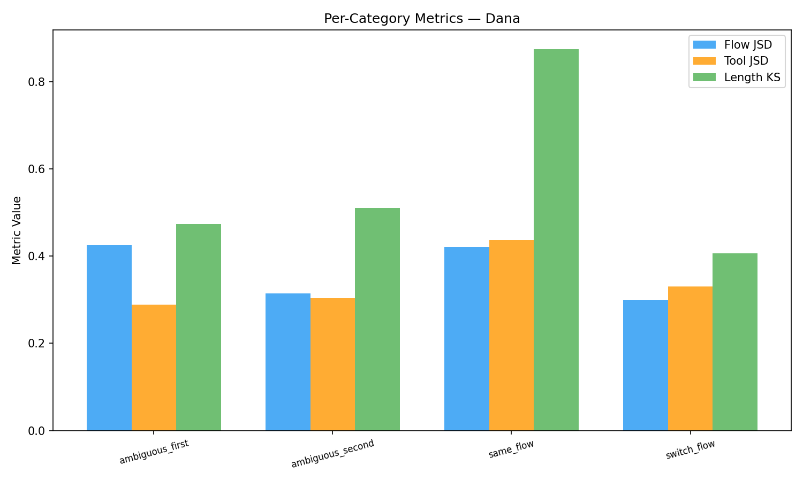
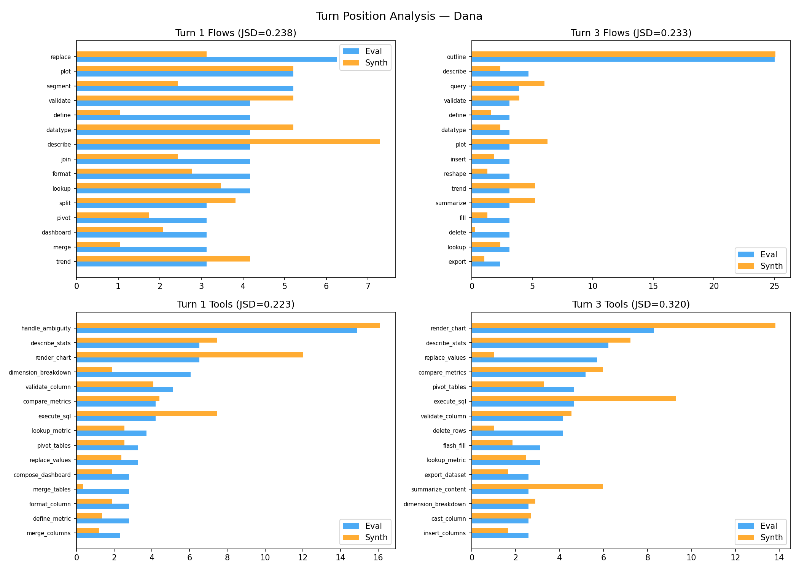
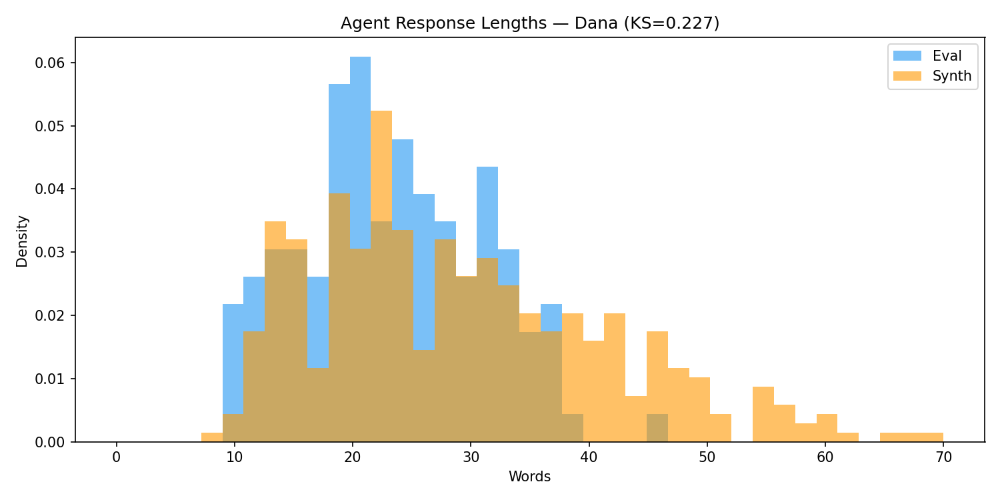
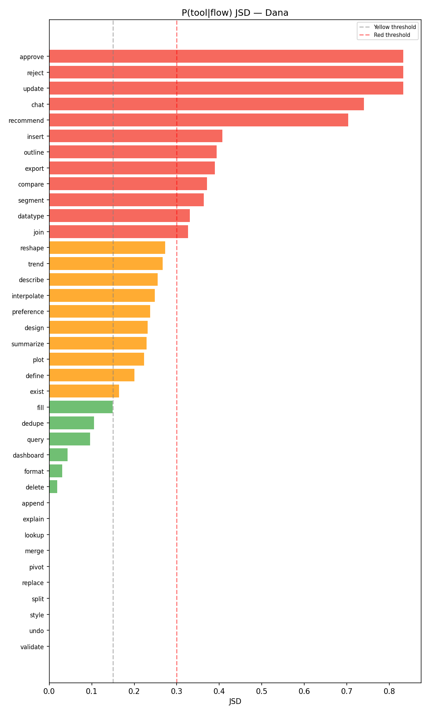
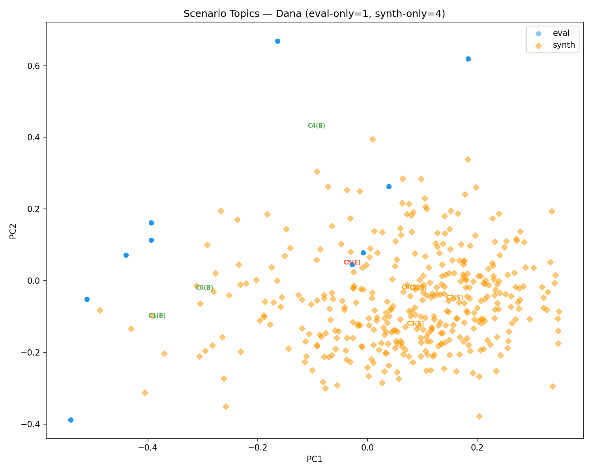

# Synthetic vs Eval: Distribution Analysis

## Executive Summary

**Dana**: Flow JSD=0.167, Intent JSD=0.088, Tool coverage=93.5%. Vocab Jaccard=0.200. 3 eval tools missing from synth.

## Intrinsic Quality Scorecard

| Signal | Metric | Rating | Green / Yellow | Red |
|--------|--------|--------|----------------|-----|
| **Dana** | | | | |
| Flow uniformity | ratio = 0.93 | 🟢 | > 0.85 / > 0.7 | <= 0.7 |
| Tool uniformity | ratio = 0.85 | 🟡 | > 0.85 / > 0.7 | <= 0.7 |

## Comparative Scorecard

| Signal | Metric | Rating | Green / Yellow | Red |
|--------|--------|--------|----------------|-----|
| **Dana** | | | | |
| Flow match | JSD = 0.167 | 🔴 | < 0.05 / < 0.15 | >= 0.15 |
| Intent match | JSD = 0.088 | 🟡 | < 0.05 / < 0.15 | >= 0.15 |
| Length match | KS = 0.518 | 🔴 | < 0.1 / < 0.3 | >= 0.3 |
| Vocab overlap | Jaccard = 0.200 | 🔴 | > 0.6 / > 0.3 | <= 0.3 |
| Tool coverage | 93.5% | 🟡 | > 0.95 / > 0.8 | <= 0.8 |
| Flow pair coverage | 61.5% | 🟡 | > 0.8 / > 0.6 | <= 0.6 |
| Turn-3 flow match | JSD = 0.233 | 🔴 | < 0.05 / < 0.15 | >= 0.15 |
| ambiguous_first flow | JSD = 0.426 | 🔴 | < 0.05 / < 0.15 | >= 0.15 |
| ambiguous_second flow | JSD = 0.315 | 🔴 | < 0.05 / < 0.15 | >= 0.15 |

## 1. Intrinsic Quality

### Dana

#### Flow Diversity

Entropy = 4.870, Unique flows = 38, Uniformity = 0.928

#### Intent Diversity

Entropy = 2.524, Unique intents = 6

#### Tool Diversity

Entropy = 4.842, Unique tools = 53, Mean tools/turn = 1.40

### Model-Specific Effects (Cross-Domain)

| Provider | n | Mean Length | Std Length | TTR |
|----------|---|------------|-----------|-----|
| anthropic | 192 | 26.1 | 5.9 | 0.246 |
| openai | 192 | 23.6 | 6.5 | 0.283 |
| openrouter | 382 | 15.8 | 5.1 | 0.237 |

## 2. Distribution Match

### Dana

#### Flow Distribution

JSD = 0.1667, χ² = 176.1 (p = 5.255e-20)

**Flagged flows** (ratio < 0.5 or > 2.0):

- `approve`: 0.45x
- `chat`: 4.01x
- `compare`: 2.34x
- `define`: 0.38x
- `delete`: 0.33x
- `exist`: 2.45x
- `merge`: 0.40x
- `recommend`: 4.01x
- `replace`: 0.37x

#### Intent Distribution

JSD = 0.0883, χ² = 39.9 (p = 1.585e-07)

| Intent | Eval | Synth |
|--------|------|-------|
| Analyze | 45 | 158 |
| Clean | 49 | 132 |
| Converse | 14 | 62 |
| Plan | 32 | 96 |
| Report | 36 | 132 |
| Transform | 48 | 91 |

#### Category Balance

| Category | Eval | Synth |
|----------|------|-------|
| same_flow | 32 | 96 |
| switch_flow | 32 | 96 |
| ambiguous_first | 32 | 95 |
| ambiguous_second | 32 | 96 |

#### Utterance Length

Turn 1 KS = 0.405 (p = 1.304e-14), Turn 3 KS = 0.518 (p = 3.360e-24)

| Stat | Eval T1 | Synth T1 | Eval T3 | Synth T3 |
|------|---------|----------|---------|----------|
| mean | 13.4 | 19.7 | 13.1 | 21.0 |
| median | 13.0 | 19.0 | 13.0 | 21.0 |
| std | 4.6 | 7.4 | 5.5 | 7.3 |
| p10 | 8.0 | 11.0 | 7.0 | 12.0 |
| p90 | 19.3 | 29.0 | 21.3 | 30.0 |

#### Vocabulary

Eval TTR = 0.260 (878 types), Synth TTR = 0.171 (2665 types), Jaccard = 0.200

**Eval-exclusive words** (freq >= 2, top 20):

`shipping` (7), `oh` (6), `ok` (6), `own` (5), `impressions` (5), `warehouses` (4), `tenure` (4), `segments` (4), `likes` (4), `repeated` (4), `shares` (4), `inventory` (4), `feed` (3), `mom` (3), `comments` (3), `says` (3), `adoption` (3), `satisfaction_score` (3), `link` (3), `june` (2)

#### Tool Usage

JSD = 0.2298, Coverage = 93.5%

**Missing from synth** (critical): `brainstorm_ideas`, `conversational_response`, `detect_issues`

**Synth-only** (noise): `compute_correlation`, `coordinate_context`, `list_datasets`, `load_dataset`, `modify_cell`, `read_flow_stack`, `recommend`, `render_chart_alt`, `root_cause_analysis`, `search_reference`

Mean tools/turn: eval=1.59, synth=1.40

#### Flow Co-occurrence

Cosine similarity = 0.568, Pair coverage = 61.5% (104 eval, 174 synth)

**Missing transitions** (40 pairs):
- `ambiguous` -> `export`
- `ambiguous` -> `join`
- `ambiguous` -> `reshape`
- `ambiguous` -> `style`
- `append` -> `dedupe`
- `approve` -> `export`
- `approve` -> `outline`
- `approve` -> `split`
- `compare` -> `fill`
- `compare` -> `pivot`

#### Embedding Similarity

Within-eval = 0.147, Within-synth = 0.145, Cross-set = 0.130 (NOT well-mixed)

#### Parameter Completeness

Eval null rate = 21.7% (175/806), Synth null rate = 12.7% (483/3801)

#### Context Dependence

Terse turn-3 rate (< 8 words): eval=14.1% (18/128), synth=3.4% (13/383)

## 3. Transfer Gap Deep-Dives

### Dana

#### Per-Category Metrics

| Category | Flow JSD | Tool JSD | Length KS | Terse % (eval) | Terse % (synth) |
|----------|----------|----------|-----------|----------------|-----------------|
| same_flow | 0.421 | 0.437 | 0.875 | 21.9% | 0.0% |
| switch_flow | 0.300 | 0.330 | 0.406 | 12.5% | 1.0% |
| ambiguous_first | 0.426 | 0.289 | 0.474 | 21.9% | 12.6% |
| ambiguous_second | 0.315 | 0.303 | 0.510 | 0.0% | 0.0% |

#### Turn Position Analysis

| Turn | Flow JSD | Tool JSD |
|------|----------|----------|
| Turn 1 | 0.238 | 0.223 |
| Turn 3 | 0.233 | 0.320 |

#### Agent Response Comparison

Length KS = 0.227, Vocab Jaccard = 0.213

Mean length: eval = 23.3, synth = 29.1

#### Conditional Distributions

Avg P(tool|flow) JSD = 0.245, Avg P(flow|intent) JSD = 0.134

| Flow | P(tool&#124;flow) JSD |
|------|---------------------|
| approve | 0.833 **!** |
| reject | 0.833 **!** |
| update | 0.833 **!** |
| chat | 0.740 **!** |
| recommend | 0.703 **!** |
| insert | 0.407 **!** |
| outline | 0.394 **!** |
| export | 0.390 **!** |
| compare | 0.371 **!** |
| segment | 0.364 **!** |

| Intent | P(flow&#124;intent) JSD |
|--------|----------------------|
| Converse | 0.235 |
| Analyze | 0.159 |
| Transform | 0.155 |
| Clean | 0.136 |
| Report | 0.121 |
| Plan | 0.000 |

Worst conditional gaps: `approve` (0.833), `reject` (0.833), `update` (0.833), `chat` (0.740), `recommend` (0.703)

#### Scenario Topic Coverage

8 clusters: 1 eval-only, 4 synth-only, coverage = 75.0%

| Cluster | Eval | Synth | Status |
|---------|------|-------|--------|
| 0 | 53 | 13 | both |
| 1 | 11 | 16 | both |
| 2 | 0 | 29 | synth-only |
| 3 | 0 | 99 | synth-only |
| 4 | 52 | 6 | both |
| 5 | 12 | 0 | eval-only |
| 6 | 0 | 133 | synth-only |
| 7 | 0 | 87 | synth-only |

## 4. Recommendations

### Dana

- **High flow JSD**: Significant flow distribution mismatch. Consider rebalancing generation.
- **Tool coverage gaps**: 3 eval tools missing from synth: brainstorm_ideas, conversational_response, detect_issues
- **Low vocabulary overlap**: Synthetic language diverges from eval. Review generation prompts.
- **Under-represented terse follow-ups**: Synth lacks short context-dependent turn-3 utterances.
