# Synthetic vs Eval: Distribution Analysis

## Executive Summary

**Dana**: Flow JSD=0.167, Intent JSD=0.088, Tool coverage=93.5%. Vocab Jaccard=0.200. 3 eval tools missing from synth.

**Hugo**: Flow JSD=0.225, Intent JSD=0.068, Tool coverage=92.7%. Vocab Jaccard=0.176. 3 eval tools missing from synth.

## Transfer Risk Scorecard

| Signal | Metric | Rating | Green / Yellow | Red |
|--------|--------|--------|----------------|-----|
| **Dana** | | | | |
| Flow match | JSD = 0.167 | 🔴 | < 0.05 / < 0.15 | >= 0.15 |
| Intent match | JSD = 0.088 | 🟡 | < 0.05 / < 0.15 | >= 0.15 |
| Length match | KS = 0.518 | 🔴 | < 0.1 / < 0.3 | >= 0.3 |
| Vocab overlap | Jaccard = 0.200 | 🔴 | > 0.6 / > 0.3 | <= 0.3 |
| Tool coverage | 93.5% | 🟡 | > 95% / > 80% | <= 80% |
| Flow pair coverage | 61.5% | 🟡 | > 80% / > 60% | <= 60% |
| **Hugo** | | | | |
| Flow match | JSD = 0.225 | 🔴 | < 0.05 / < 0.15 | >= 0.15 |
| Intent match | JSD = 0.068 | 🟡 | < 0.05 / < 0.15 | >= 0.15 |
| Length match | KS = 0.510 | 🔴 | < 0.1 / < 0.3 | >= 0.3 |
| Vocab overlap | Jaccard = 0.176 | 🔴 | > 0.6 / > 0.3 | <= 0.3 |
| Tool coverage | 92.7% | 🟡 | > 95% / > 80% | <= 80% |
| Flow pair coverage | 60.4% | 🟡 | > 80% / > 60% | <= 60% |

## 1. Distribution Analyses

### Dana

#### Flow Distribution

JSD = 0.1667, χ² = 176.1 (p = 5.255e-20)

**Flagged flows** (ratio < 0.5 or > 2.0):

- `approve`: 0.45x
- `chat`: 4.01x
- `compare`: 2.34x
- `define`: 0.38x
- `delete`: 0.33x
- `exist`: 2.45x
- `merge`: 0.40x
- `recommend`: 4.01x
- `replace`: 0.37x

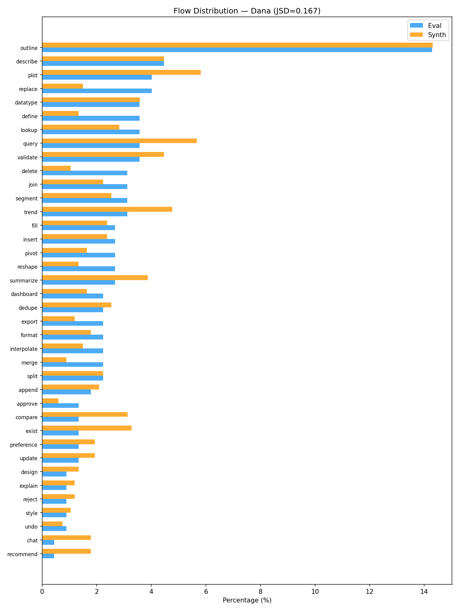

#### Intent Distribution

JSD = 0.0883, χ² = 39.9 (p = 1.585e-07)

| Intent | Eval | Synth |
|--------|------|-------|
| Analyze | 45 | 158 |
| Clean | 49 | 132 |
| Converse | 14 | 62 |
| Plan | 32 | 96 |
| Report | 36 | 132 |
| Transform | 48 | 91 |

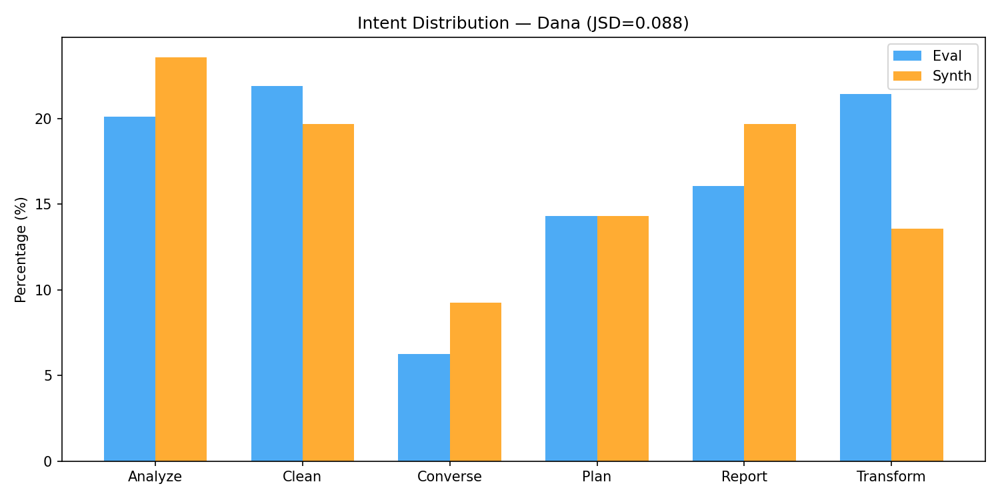

#### Category Balance

| Category | Eval | Synth |
|----------|------|-------|
| same_flow | 32 | 96 |
| switch_flow | 32 | 96 |
| ambiguous_first | 32 | 95 |
| ambiguous_second | 32 | 96 |

#### Utterance Length

Turn 1 KS = 0.405 (p = 1.304e-14), Turn 3 KS = 0.518 (p = 3.360e-24)

| Stat | Eval T1 | Synth T1 | Eval T3 | Synth T3 |
|------|---------|----------|---------|----------|
| mean | 13.4 | 19.7 | 13.1 | 21.0 |
| median | 13.0 | 19.0 | 13.0 | 21.0 |
| std | 4.6 | 7.4 | 5.5 | 7.3 |
| p10 | 8.0 | 11.0 | 7.0 | 12.0 |
| p90 | 19.3 | 29.0 | 21.3 | 30.0 |

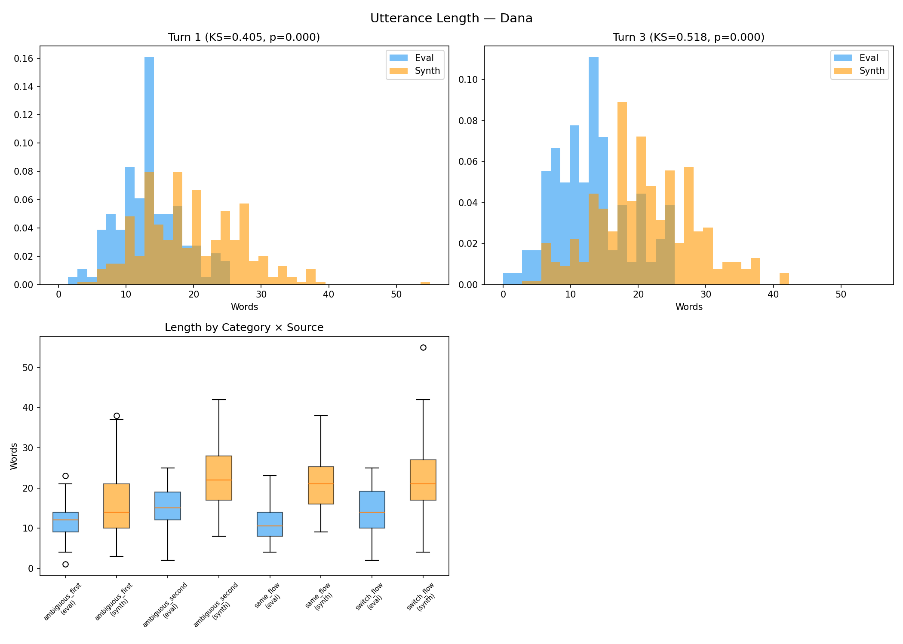

#### Vocabulary

Eval TTR = 0.260 (878 types), Synth TTR = 0.171 (2665 types), Jaccard = 0.200

**Eval-exclusive words** (freq >= 2, top 20):

`shipping` (7), `oh` (6), `ok` (6), `impressions` (5), `own` (5), `tenure` (4), `inventory` (4), `likes` (4), `repeated` (4), `segments` (4), `shares` (4), `warehouses` (4), `feed` (3), `comments` (3), `link` (3), `mom` (3), `satisfaction_score` (3), `says` (3), `adoption` (3), `web` (2)

#### Tool Usage

JSD = 0.2298, Coverage = 93.5%

**Missing from synth** (critical): `brainstorm_ideas`, `conversational_response`, `detect_issues`

**Synth-only** (noise): `compute_correlation`, `coordinate_context`, `list_datasets`, `load_dataset`, `modify_cell`, `read_flow_stack`, `recommend`, `render_chart_alt`, `root_cause_analysis`, `search_reference`

Mean tools/turn: eval=1.59, synth=1.40

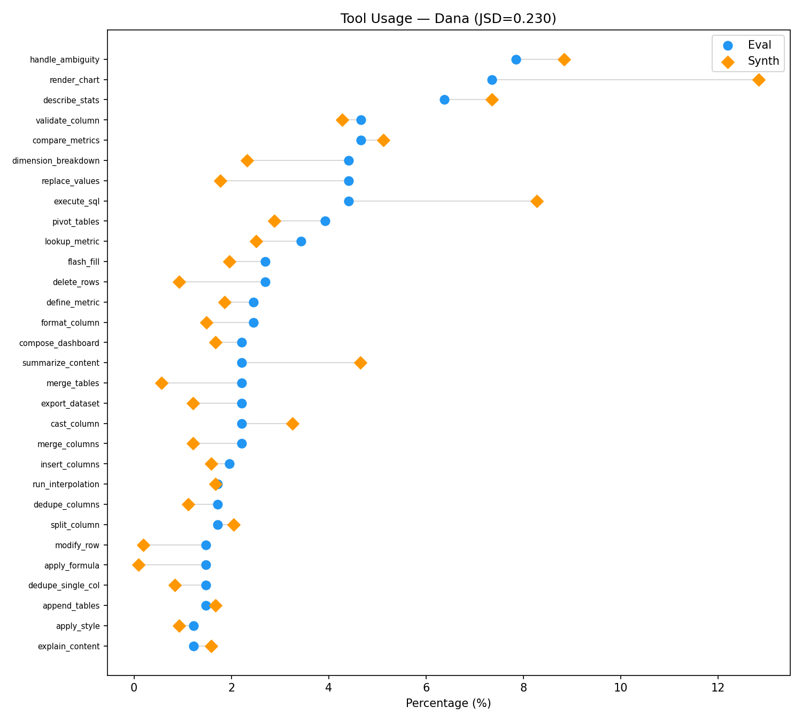

#### Flow Co-occurrence

Cosine similarity = 0.568, Pair coverage = 61.5% (104 eval, 174 synth)

**Missing transitions** (40 pairs):
- `ambiguous` -> `export`
- `ambiguous` -> `join`
- `ambiguous` -> `reshape`
- `ambiguous` -> `style`
- `append` -> `dedupe`
- `approve` -> `export`
- `approve` -> `outline`
- `approve` -> `split`
- `compare` -> `fill`
- `compare` -> `pivot`

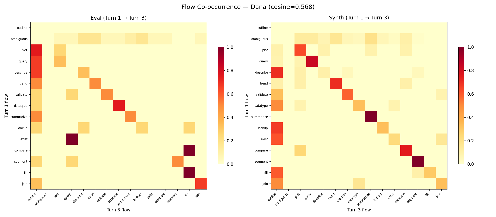

#### Embedding Similarity

Within-eval = 0.033, Within-synth = 0.039, Cross-set = 0.020 (NOT well-mixed)

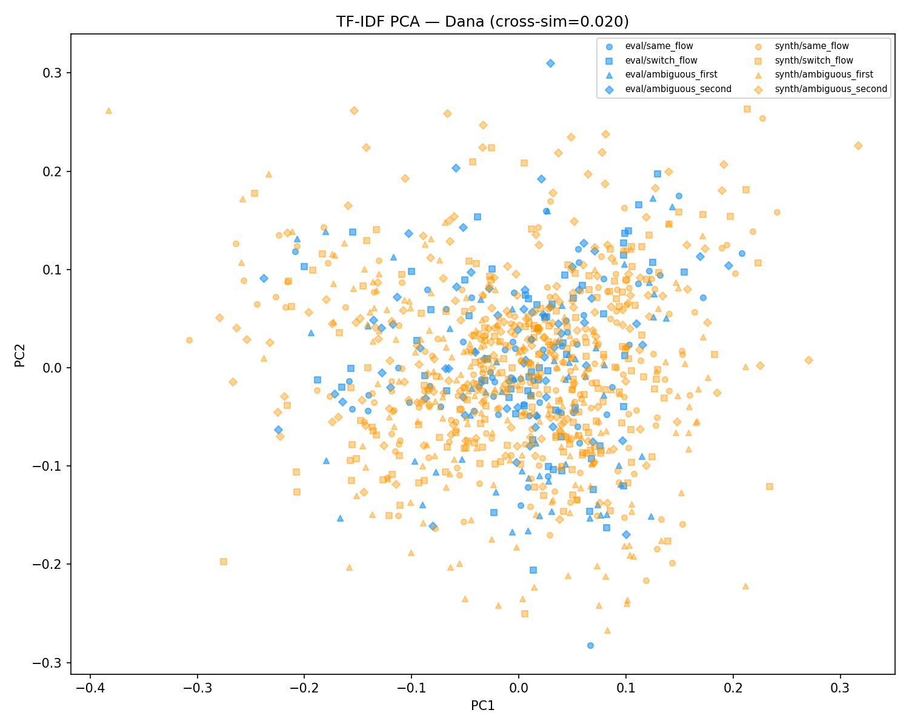

#### Parameter Completeness

Eval null rate = 21.7% (175/806), Synth null rate = 12.7% (483/3801)

#### Context Dependence

Terse turn-3 rate (< 8 words): eval=14.1% (18/128), synth=3.4% (13/383)

### Hugo

#### Flow Distribution

JSD = 0.2251, χ² = 624.5 (p = 1.007e-109)

**Flagged flows** (ratio < 0.5 or > 2.0):

- `browse`: 2.21x
- `check`: 0.47x
- `compare`: 0.50x
- `diff`: 0.50x
- `endorse`: infx
- `expand`: 0.21x
- `outline`: 12.94x
- `preview`: 3.82x
- `promote`: 0.20x
- `schedule`: 0.33x
- `suggest`: 2.16x

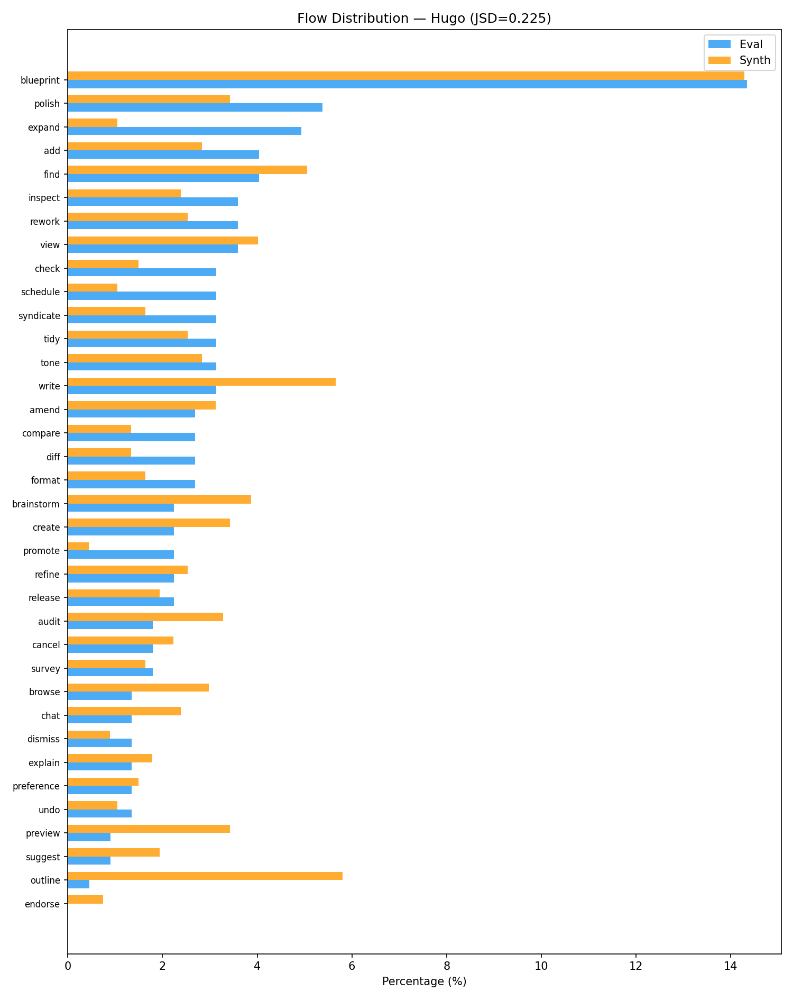

#### Intent Distribution

JSD = 0.0681, χ² = 26.6 (p = 6.762e-05)

| Intent | Eval | Synth |
|--------|------|-------|
| Converse | 17 | 69 |
| Draft | 43 | 169 |
| Plan | 32 | 96 |
| Publish | 34 | 83 |
| Research | 47 | 123 |
| Revise | 50 | 132 |

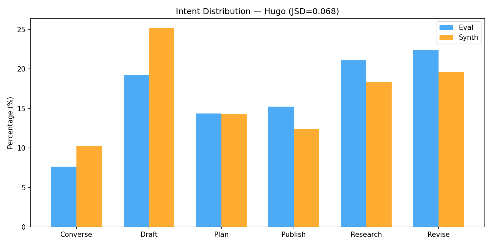

#### Category Balance

| Category | Eval | Synth |
|----------|------|-------|
| same_flow | 32 | 96 |
| switch_flow | 32 | 96 |
| ambiguous_first | 32 | 96 |
| ambiguous_second | 32 | 96 |

#### Utterance Length

Turn 1 KS = 0.375 (p = 1.713e-12), Turn 3 KS = 0.510 (p = 2.540e-23)

| Stat | Eval T1 | Synth T1 | Eval T3 | Synth T3 |
|------|---------|----------|---------|----------|
| mean | 14.0 | 21.6 | 13.1 | 23.2 |
| median | 14.0 | 20.0 | 13.5 | 22.0 |
| std | 4.9 | 11.7 | 5.4 | 10.2 |
| p10 | 7.0 | 11.0 | 6.0 | 12.3 |
| p90 | 21.0 | 34.0 | 21.0 | 35.0 |

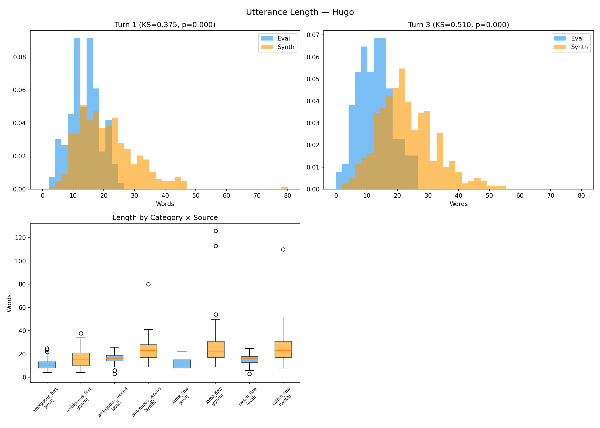

#### Vocabulary

Eval TTR = 0.231 (801 types), Synth TTR = 0.175 (3005 types), Jaccard = 0.176

**Eval-exclusive words** (freq >= 2, top 20):

`roundup` (13), `essay` (8), `authentication` (6), `thailand` (6), `thursday` (6), `living` (6), `noise` (5), `transformer` (5), `wanna` (5), `how's` (5), `vietnam` (5), `bangkok` (4), `error` (4), `async` (4), `self-attention` (4), `pin` (4), `yesterday` (3), `southeast` (3), `squash` (3), `positional` (3)

#### Tool Usage

JSD = 0.2593, Coverage = 92.7%

**Missing from synth** (critical): `conversational_response`, `search_sources`, `web_search`

**Synth-only** (noise): `analyze_seo`, `coordinate_context`, `delete_section`, `draft_content`, `heads_or_tails`, `publish_post_promote`, `read_flow_stack`, `read_outline`, `rework`, `suggest_keywords`

Mean tools/turn: eval=1.70, synth=1.68

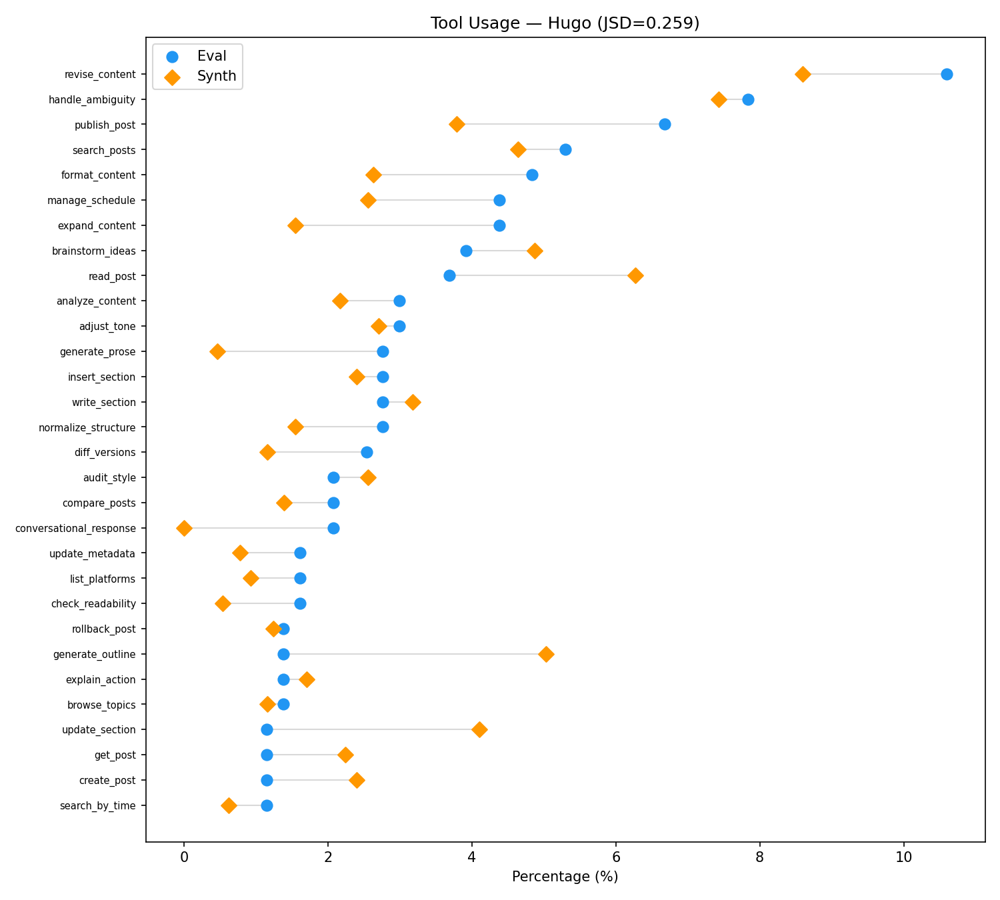

#### Flow Co-occurrence

Cosine similarity = 0.423, Pair coverage = 60.4% (101 eval, 175 synth)

**Missing transitions** (40 pairs):
- `add` -> `dismiss`
- `add` -> `release`
- `ambiguous` -> `blueprint`
- `ambiguous` -> `format`
- `amend` -> `blueprint`
- `amend` -> `preference`
- `amend` -> `tone`
- `browse` -> `explain`
- `cancel` -> `inspect`
- `check` -> `compare`

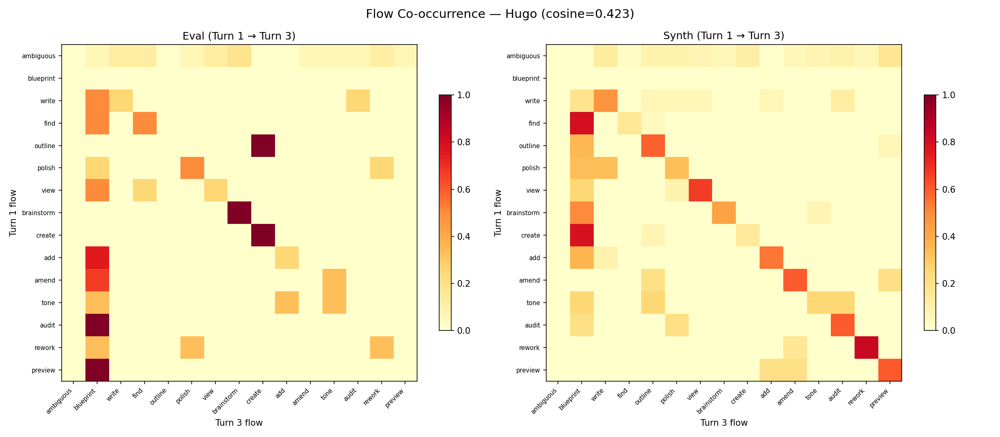

#### Embedding Similarity

Within-eval = 0.037, Within-synth = 0.042, Cross-set = 0.022 (NOT well-mixed)

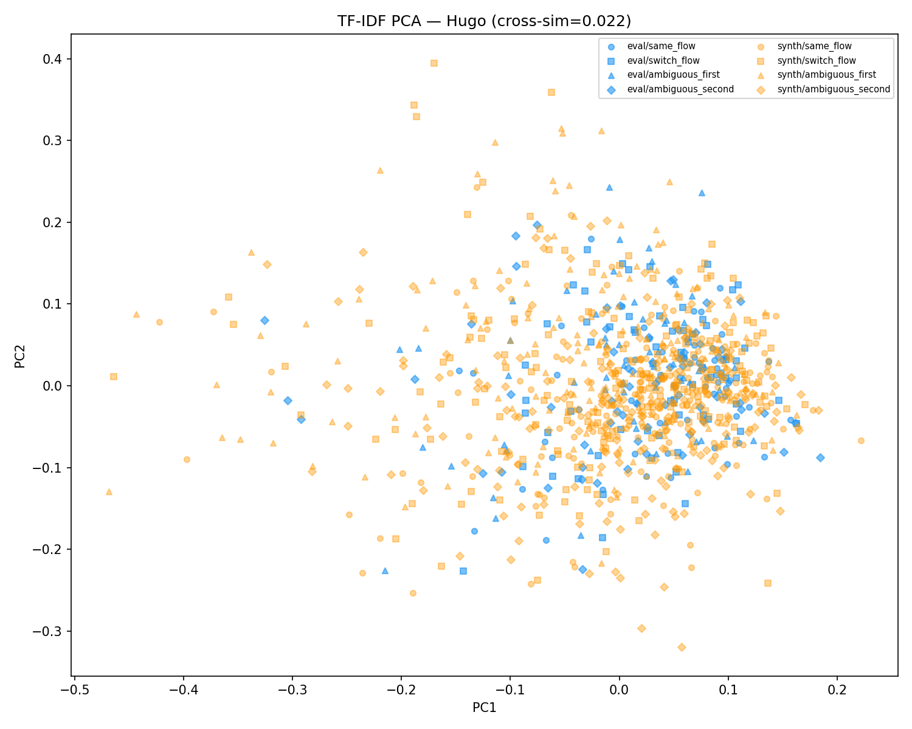

#### Parameter Completeness

Eval null rate = 34.3% (228/664), Synth null rate = 17.8% (595/3348)

#### Context Dependence

Terse turn-3 rate (< 8 words): eval=14.1% (18/128), synth=2.3% (9/384)

## 3. Model-Specific Effects

| Provider | n | Mean Length | Std Length | TTR |
|----------|---|------------|-----------|-----|
| anthropic | 384 | 26.9 | 7.4 | 0.196 |
| openai | 384 | 26.4 | 11.6 | 0.247 |
| openrouter | 766 | 16.1 | 5.3 | 0.201 |

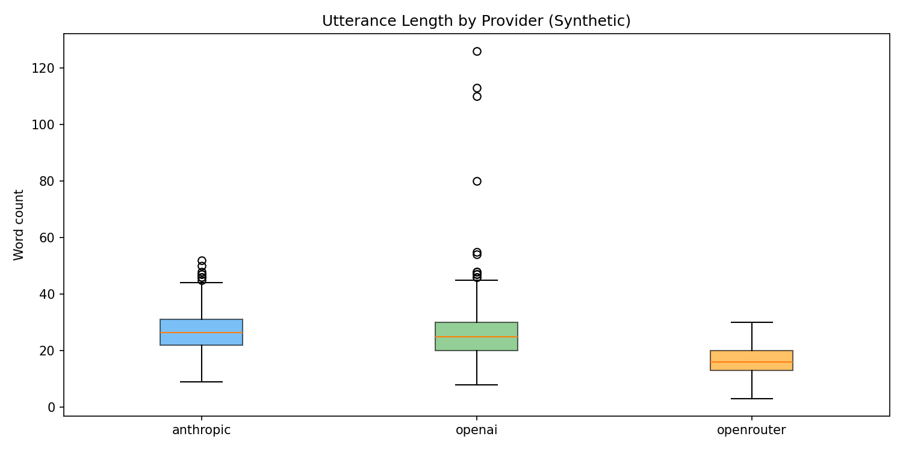

## 4. Recommendations

### Dana

- **High flow JSD**: Significant flow distribution mismatch. Consider rebalancing generation.
- **Tool coverage gaps**: 3 eval tools missing from synth: brainstorm_ideas, conversational_response, detect_issues
- **Low vocabulary overlap**: Synthetic language diverges from eval. Review generation prompts.
- **Under-represented terse follow-ups**: Synth lacks short context-dependent turn-3 utterances.

### Hugo

- **High flow JSD**: Significant flow distribution mismatch. Consider rebalancing generation.
- **Tool coverage gaps**: 3 eval tools missing from synth: conversational_response, search_sources, web_search
- **Low vocabulary overlap**: Synthetic language diverges from eval. Review generation prompts.
- **Under-represented terse follow-ups**: Synth lacks short context-dependent turn-3 utterances.
